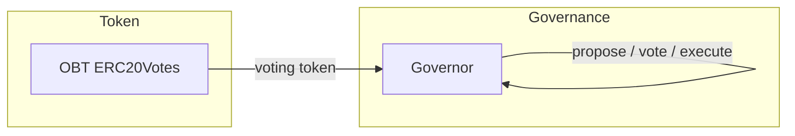

# OBT ERC-20 Token and Token-Weighted Governance

## Approach

- **Token:** ERC-20 “OBT” with a fixed supply of 1,000,000 tokens, using OpenZeppelin’s **ERC20Votes** so voting weight is based on past balances (delegate and checkpoint) and fits standard governor tooling.
- **Governance:** OpenZeppelin **Governor** (GovernorVotes) **so only OBT holders can propose and vote, with voting power = delegated balance. No Timelock in the initial scope to keep the first version simple; it can be added later.**

---

## 1. Project setup

- Initialize a **Hardhat** project in the repo root (TypeScript or JavaScript; TypeScript recommended).
- Add **OpenZeppelin Contracts** (v5): `@openzeppelin/contracts` for ERC20, ERC20Votes, Governor, and EIP-712/Nonces as needed.
- Add **dotenv** (and optionally **hardhat-verify**) for deployment and verification.
- Create minimal config: default network, Solidity version (e.g. `^0.8.20`), and compiler settings. No need for multiple networks in the initial plan beyond a local/live distinction.

---

## 2. OBT token contract

- **Contract name:** e.g. `OBTToken.sol` (or `OBT.sol`).
- **Inheritance:** `ERC20`, `ERC20Permit`, `ERC20Votes` (all from OpenZeppelin).
  - `ERC20`: standard token, 18 decimals, total supply 1,000,000e18.
  - `ERC20Permit`: gasless approvals (optional but useful for UX).
  - `ERC20Votes`: delegation and checkpoint history for governance.
- **Constructor:** 
  - Call `ERC20("OBT", "OBT")` and `_mint(msg.sender, 1_000_000 * 10**18)` (or deployer/treasury address if you prefer not to mint to deployer).
- **Clock:** Use EIP-6372 “clock” (block number or timestamp) as required by your Governor version; OpenZeppelin GovernorVotes typically uses block number.

**Files to add:** e.g. `contracts/OBTToken.sol`.

---

## 3. Governance contract

- **Governor:** One contract inheriting OpenZeppelin’s **Governor**, **GovernorSettings**, **GovernorCountingSimple** (or **GovernorVotesQuorumFraction** if you want quorum), and **GovernorVotes**.
- **GovernorVotes:** Point to the OBT token address so voting power is read from `OBT.getPastVotes(account, blockNumber)` (and optionally `getPastTotalSupply` for quorum).
- **GovernorSettings:** Configure in constructor:
  - **Voting delay:** e.g. 1 block (or 0 for local testing).
  - **Voting period:** e.g. 50400 blocks (~1 week at 12s/block) or shorter for testing.
  - **Proposal threshold:** minimum OBT balance (e.g. 0 or a small amount) to create a proposal.
- **Quorum (optional):** If you want quorum, use **GovernorVotesQuorumFraction** (e.g. 4% of past total supply); otherwise **GovernorCountingSimple** is enough for “majority of cast votes”.
- **Execution:** Proposals execute arbitrary calls (e.g. upgrade, parameter change). No Timelock in this plan; execution is immediate upon proposal success.

**Files to add:** e.g. `contracts/OBTGovernor.sol`.

---

## 4. Deployment and wiring

- **Deploy script:** 
  1. Deploy OBT, mint full supply to deployer (or designated treasury).
  2. Deploy Governor with OBT as the voting token and the chosen settings.
  3. (Optional) Have deployer delegate their OBT to themselves so they can propose/vote in tests and demos.
- **Order:** OBT first, then Governor (Governor needs OBT address in constructor).

**Files to add:** e.g. `scripts/deploy.ts` (or `.js`).

---

## 5. Tests

- **OBT:** Unit tests for ERC20 (name, symbol, decimals, total supply, transfer) and ERC20Votes (delegate, getVotes, getPastVotes, checkpoints).
- **Governor:** Unit tests for: proposal creation (only if above proposal threshold), voting with token weight, and execution after voting period; test that non-holders cannot propose and that vote count matches delegated balance.
- Use Hardhat’s test runner and, if desired, load the same deploy script in tests to get a consistent OBT + Governor setup.

**Files to add:** e.g. `test/OBTToken.test.ts`, `test/OBTGovernor.test.ts` (or `.js`).

---

## 6. Documentation (README.md)

- Document in **README.md** (per your rules):
  - Purpose: OBT token (1M supply) and token-weighted governance.
  - Prerequisites: Node, npm/yarn.
  - Install: `npm install`, compile: `npx hardhat compile`, test: `npx hardhat test`.
  - Deploy: how to run the deploy script (e.g. `npx hardhat run scripts/deploy.ts --network <network>`).
  - Contract roles: OBT (ERC20Votes) and Governor (propose, vote, execute).
  - Main parameters: total supply 1M, voting period, proposal threshold, quorum (if used).

---

## 7. Optional follow-ups (out of scope for this plan)

- **Timelock:** Add OpenZeppelin TimelockController and make the Governor the only proposer; execute via Timelock for a delay.
- **Front-end:** A simple UI to connect wallet, delegate OBT, create proposals, vote, and execute.
- **Verification:** Add `hardhat-verify` and document verification steps for the chosen chain.

---

## File layout (summary)

| Path                        | Purpose                                     |
| --------------------------- | ------------------------------------------- |
| `package.json`              | Dependencies (Hardhat, OpenZeppelin, etc.)  |
| `hardhat.config.ts`         | Solidity version, networks, compiler        |
| `contracts/OBTToken.sol`    | ERC20 + ERC20Votes + Permit, 1M supply      |
| `contracts/OBTGovernor.sol` | Governor + GovernorVotes + settings         |
| `scripts/deploy.ts`         | Deploy OBT then Governor, optional delegate |
| `test/OBTToken.test.ts`     | OBT and voting token behavior               |
| `test/OBTGovernor.test.ts`  | Propose, vote, execute flows                |
| `README.md`                 | Plan, setup, deploy, and usage              |

---

## Design choices

- **ERC20Votes:** Required for “token-weighted” voting with historical consistency (votes tied to past block, not easily manipulable at proposal time).
- **OpenZeppelin Governor:** Standard, audited pattern; avoids reinventing proposal/vote/execute logic.
- **No Timelock in v1:** Simplifies deployment and testing; can be added in a later iteration for execution delay.

